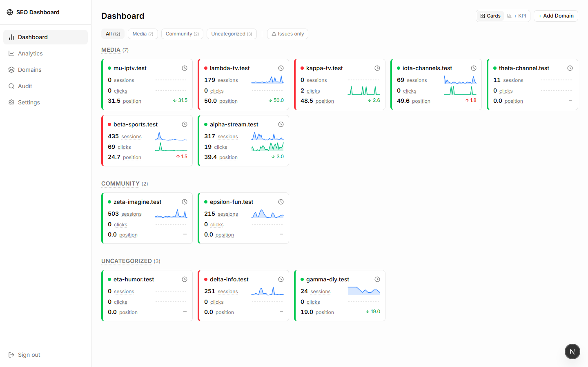
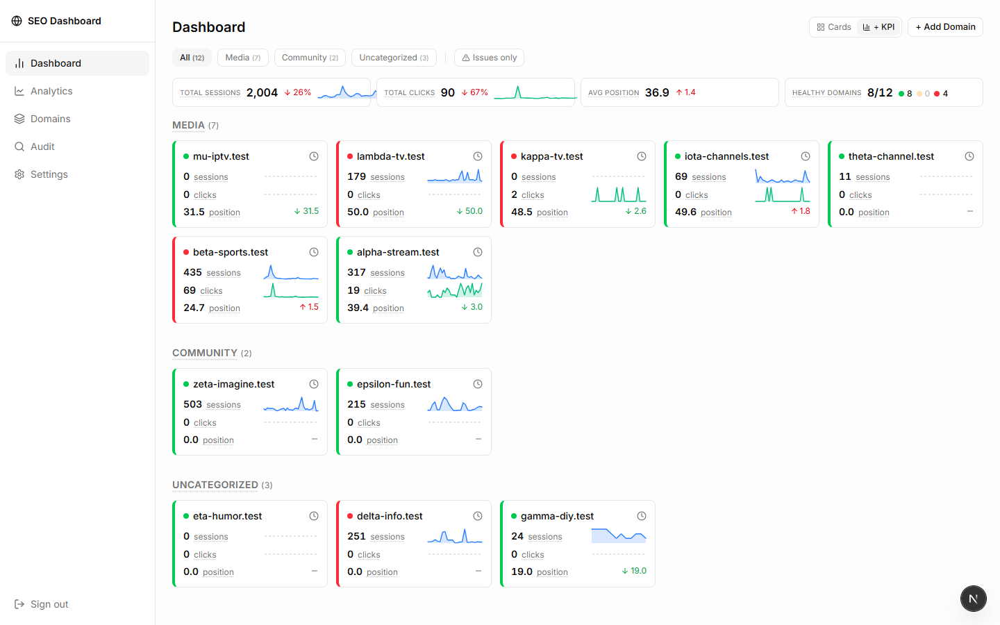
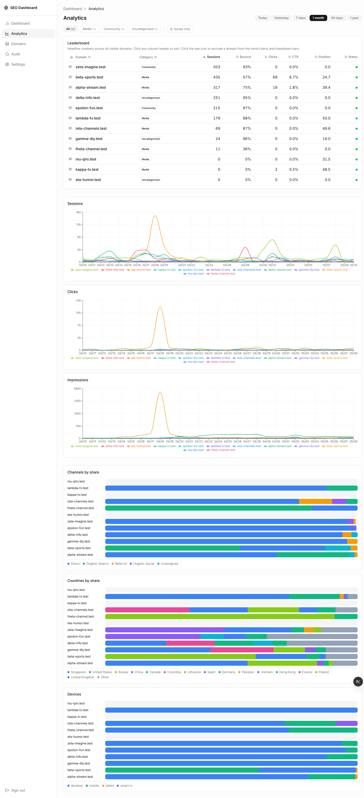
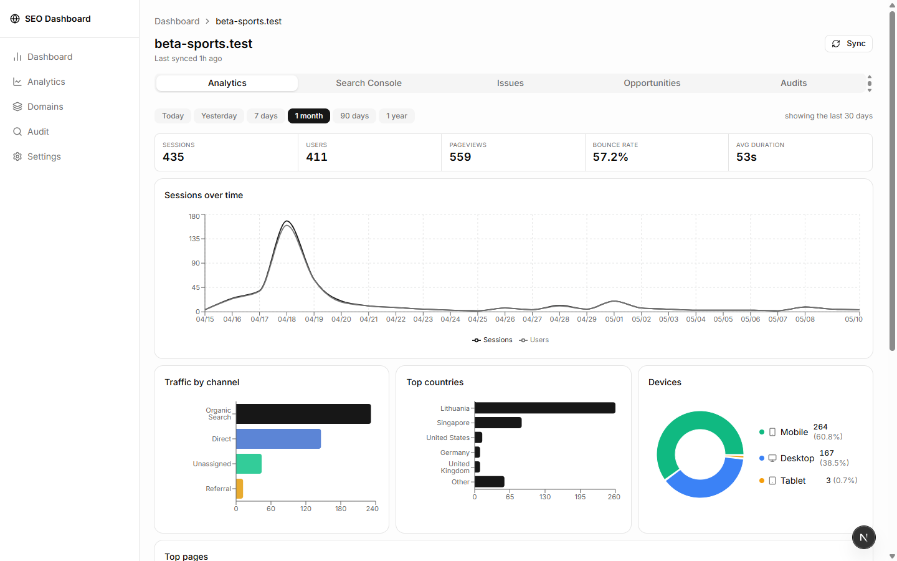
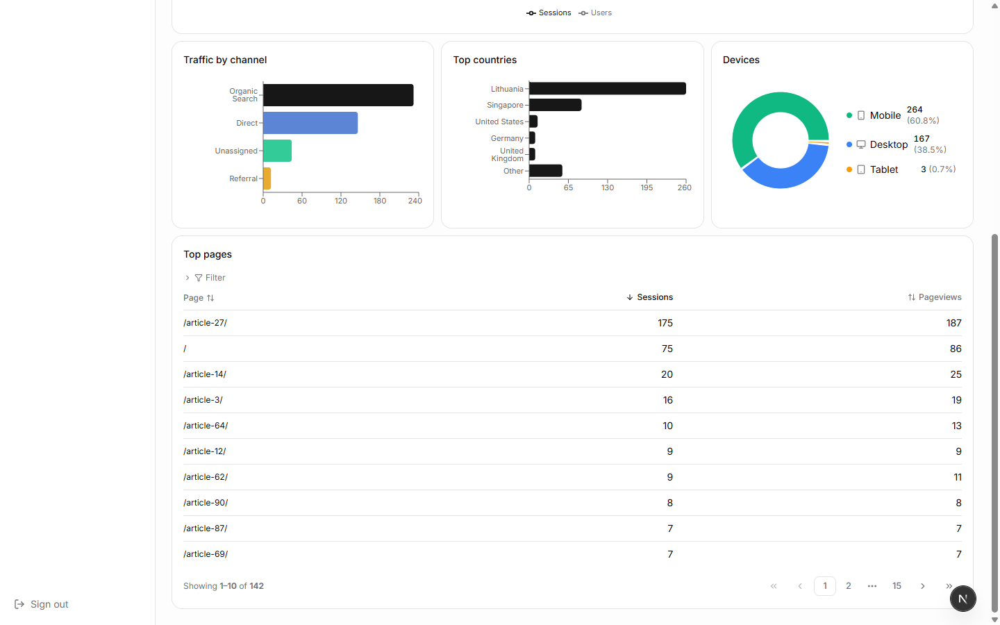
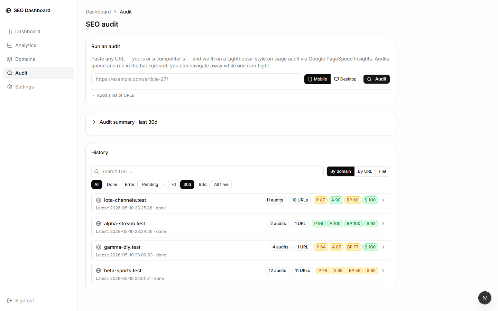
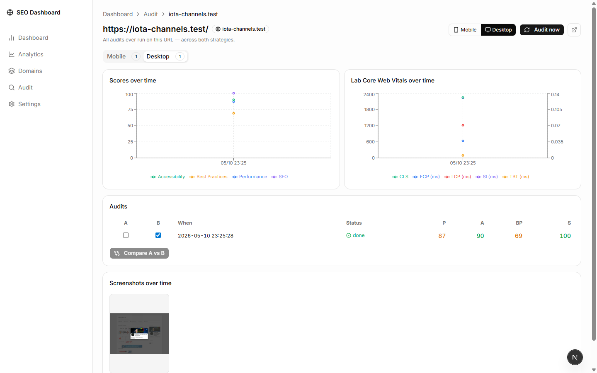

# Demo — what the dashboard looks like

Screenshots of the [SEO Analytics Dashboard](README.md) running locally. All domain names, URLs, and account identifiers in these screenshots are placeholder demo data — real hostnames and Google account info are replaced with `*.test` aliases.

> Want to try it on your own data? See [INSTALL.md](INSTALL.md).

---

## Dashboard

The landing page. Every tracked domain is a dense card grouped under its category; each card shows Sessions, Clicks, and Avg Position with inline sparklines, a coloured left border that flips amber/red when something needs attention, and a status dot for quick triage. The top-right sync icon is hover-for-timestamp / click-to-sync. Category chips at the top filter the grid.

### +KPI overlay

Toggle `+ KPI` to overlay an aggregate strip across all visible domains: Total Sessions / Clicks (sparkline-able), impression-weighted Avg Position, and a "Healthy X of N" tally with green/amber/red dots. The preference is persisted in `localStorage` so the view sticks across sessions.

---

## Cross-domain Analytics

`/analytics` puts every domain side-by-side. The sortable leaderboard at the top is the source of truth for what's included in the rest of the page — click the eye column to exclude a domain from the trend charts and breakdown bars, and the change propagates everywhere. Below it are three multi-line trend charts (Sessions / Clicks / Impressions) and three horizontal stacked-bar breakdowns (Channels / Countries / Devices). Every legend chip is click-to-hide, and tooltips show full per-line values on hover.

State is URL-bound — category chip, date range, hidden domains — so any view is shareable as a link.

---

## Per-domain detail

`/domain/[id]` is the deep-dive for one site. Five tabs — Analytics, Search Console, Issues, Opportunities, Audits — each independently date-range filterable.

The Analytics tab leads with a compact KPI strip (Sessions / Users / Pageviews / Bounce Rate / Avg Duration), a "Sessions over time" trend chart, and a three-card row of breakdowns: Traffic by channel (horizontal bars), Top countries, and Devices (donut + clickable list).

The Top pages table sits at the bottom, paginated and filterable by path. (URL paths in this screenshot are anonymized to `/article-N/` placeholders — in real use they're the actual page slugs.)

The remaining tabs cover:

- **Search Console** — clicks / impressions trend chart with dual-axis tooltip, keyword position distribution buckets (1–3, 4–10, 11–20, 21+), and a sortable Top queries table.
- **Issues** — Core Web Vitals (LCP / CLS / INP) from CrUX field data + sitemap indexing health, each metric expandable into a plain-language diagnosis with ranked fixes (high / medium / low impact tiers).
- **Opportunities** — "Quick-win keywords": queries already ranking 4–20 with above-median impressions and below-average CTR. Click a keyword for a position-aware action checklist and an estimated potential-clicks uplift.
- **Audits** — every audit ever run on this hostname, plus an "Audit top N pages" button that batches the top-clicked GSC URLs through PageSpeed Insights.

---

## SEO Audit hub

`/audit` is the entry point. The form on top takes any URL — yours or a competitor's — and queues a Lighthouse-style audit through Google PageSpeed Insights. The `[Mobile | Desktop]` toggle is sticky (saved in localStorage).

Below the form, a collapsible **Audit summary** card rolls up the last 30 days into KPI tiles, a worst-pages list, and a common-failures list. Below that, the **History** card folds by domain by default — one row per hostname with audit count, distinct URL count, and inline P/A/BP/S score pills. Drill down by clicking a row, or switch to **By URL** / **Flat** modes.

The filter bar above the history is URL-bound: search input, status chips (All / Done / Error / Pending), and date-window chips (7d / 30d / 90d / All time) all reflect in `?q=…&status=…&since=…&view=…` so any filtered view is shareable.

---

## Per-URL audit history

Click any URL in the audit hub (or the external-link icon on any history row) to land on `/audit/url?u=…` — the full history for one URL.

- **Header** shows the URL with a `Mobile / Desktop` strategy toggle plus an "Audit now" button that queues a fresh audit and refreshes the page when it completes.
- **Strategy tabs** split mobile vs desktop audits with badge counts.
- **Scores over time** — four-line trend chart (Performance / Accessibility / Best Practices / SEO) with click-to-hide legend.
- **Lab Core Web Vitals over time** — five-line chart (LCP / CLS / TBT / FCP / SI) with dual y-axis so CLS (0..1 scale) reads alongside the ms metrics.
- **Audit pair selector** — checkbox columns `A` / `B` for picking any two audits to diff. The default selection is the newest two; click **Compare A vs B** to render the Lighthouse-style diff with severity filter chips, savings-DESC sorted failing entries, and inline "Potential X saved" pills.
- **Screenshots over time** — horizontally-scrolling strip of PSI's `final-screenshot` thumbnails, click to enlarge in a lightbox.

---

## What you can't see in screenshots

A handful of things this page can't really capture:

- **Inline sparklines** — every card on the dashboard renders a tiny rolling-30-day line for Sessions and Clicks. They scale automatically and use the same colour as their KPI label.
- **Tooltips on hover** — every metric label, every score pill, every chart line has a `<Hint>` tooltip explaining what it means (no waiting for browser default delay; they pop instantly).
- **Click-to-hide legends** — every chart and breakdown bar has clickable legend chips that hide that series across all charts on the page; the bars re-balance to 100% of the remaining visible total.
- **Polling** — when an audit is queued, the row appears as "queued" and updates to "running" → "done" without you needing to refresh.
- **Inline deltas** — re-auditing a URL renders green/red `+12` / `-8` deltas next to every score gauge and a `warn → pass` transition badge next to every individual check that changed severity.

Run it locally to see the real thing — [INSTALL.md](INSTALL.md) walks through it in about 15 minutes.
